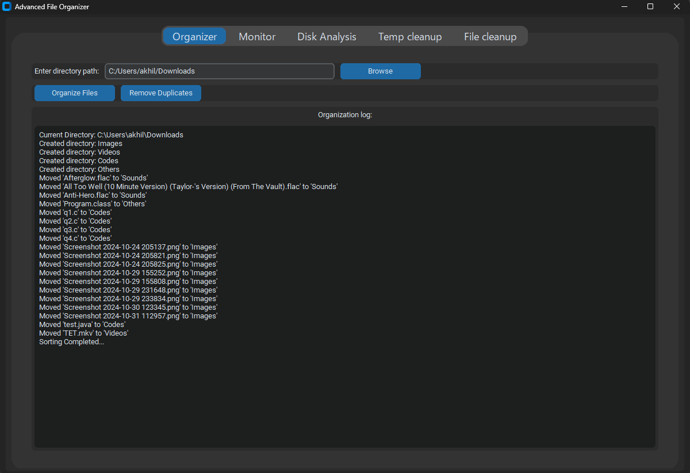
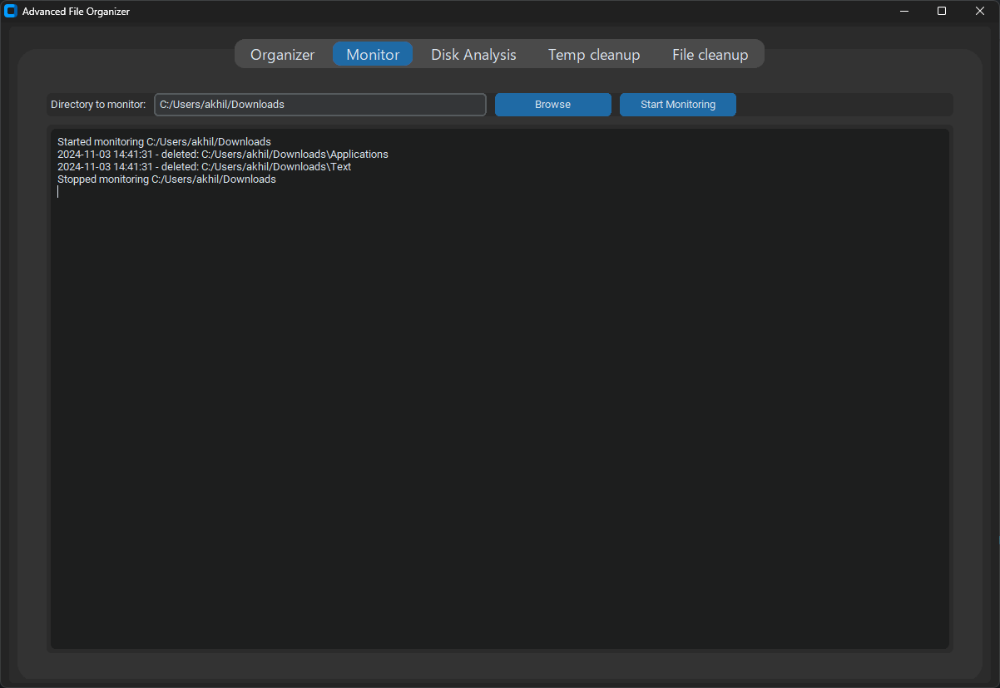
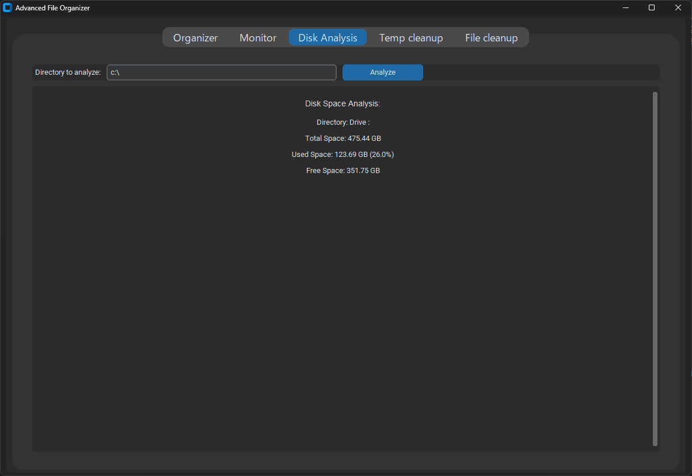
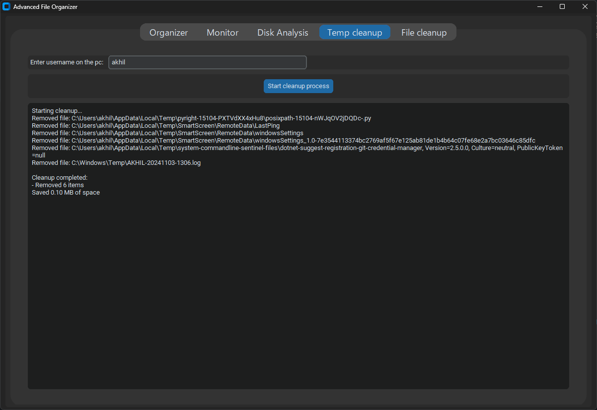
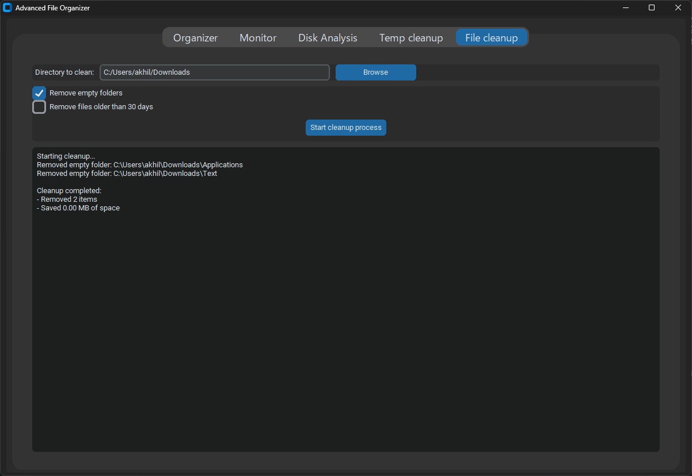

# PyManager

This project utilizes the following Python libraries:

*Standard Libraries*
- os
- shutil
- time
- tkinter
- filedialog
- datetime

*Third-Party Libraries*
- customtkinter
- watchdog
- psutil

**Features**

1. File Organizer: To organizer your files within a directory into categorized folders (e.g., Images, Videos, Documents).
3. Directory Monitor: Monitors a selected folder and logs all file system events (creations, deletions, modifications).
3. Disk Space Analyzer: Provides an overview of your disk space, highlighting used, free, and total storage.
4. Temporary Files Cleanup: Automatically deletes temporary files from Windows Temp folders to free up disk space.
5. Folder Cleanup: Customizable cleanup of selected folders, removing old files, empty directories etc.

**Screenshots**

